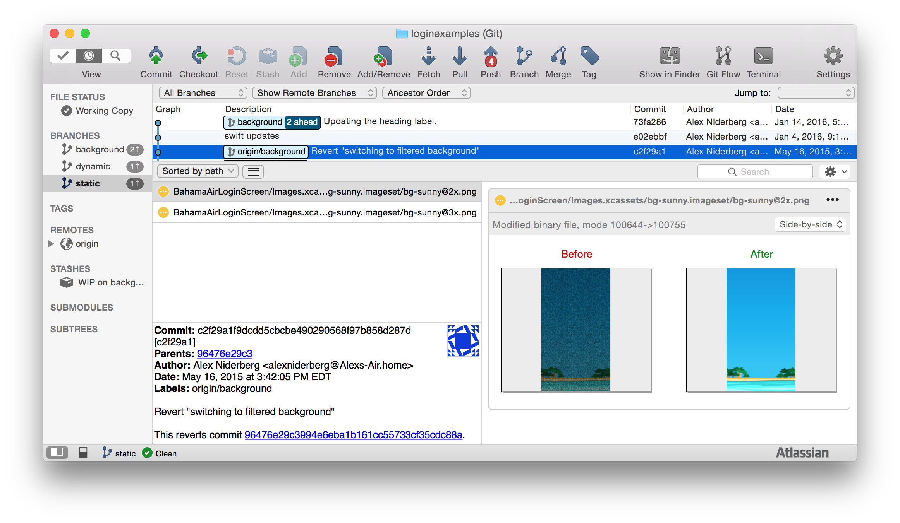
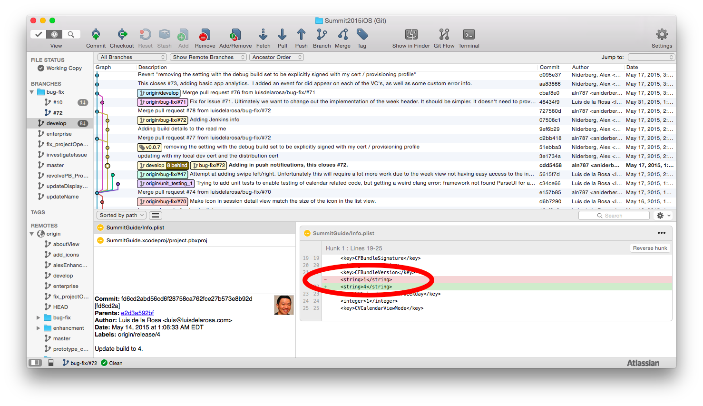
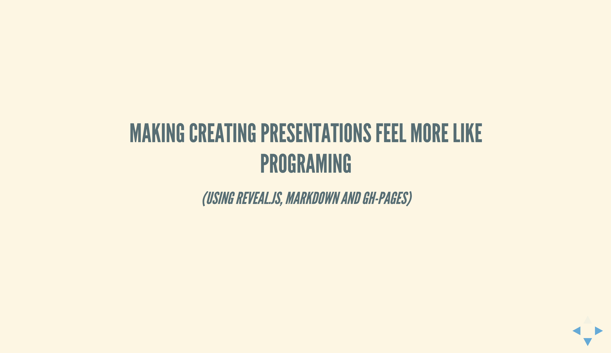
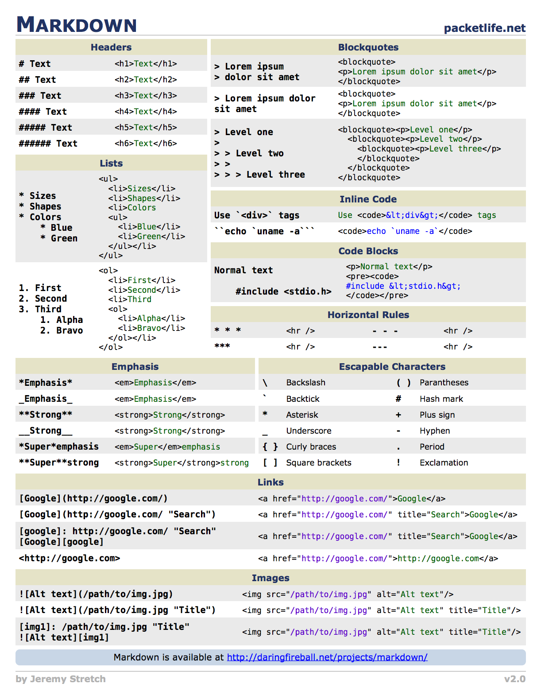
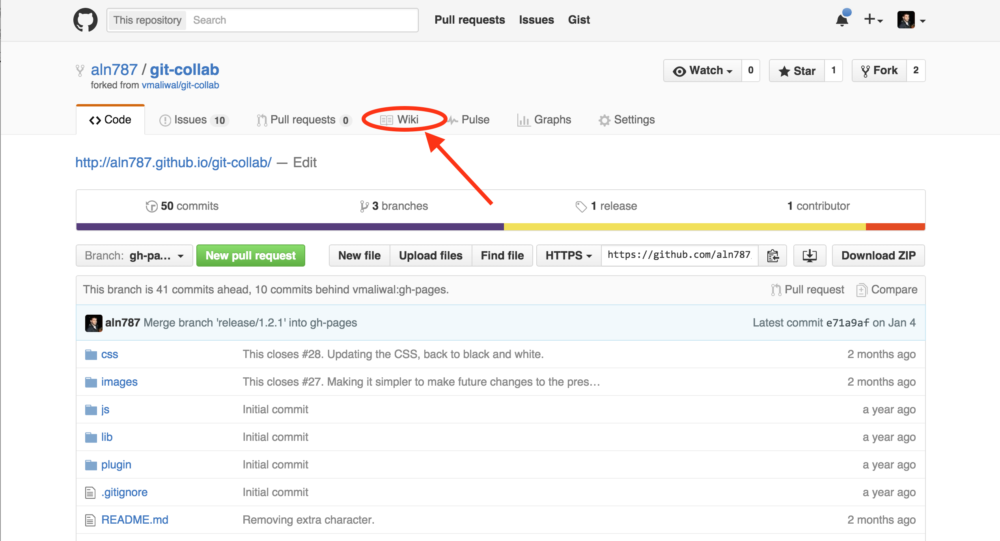
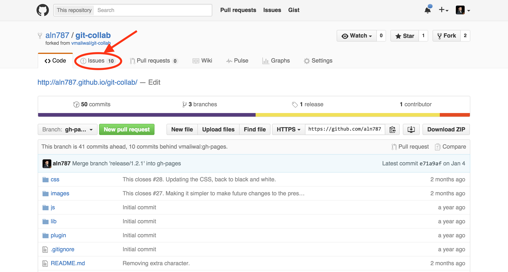
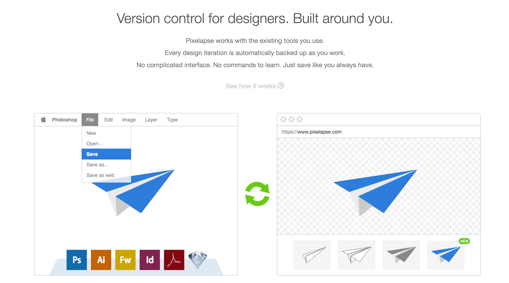
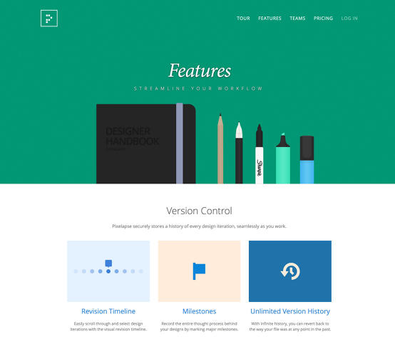
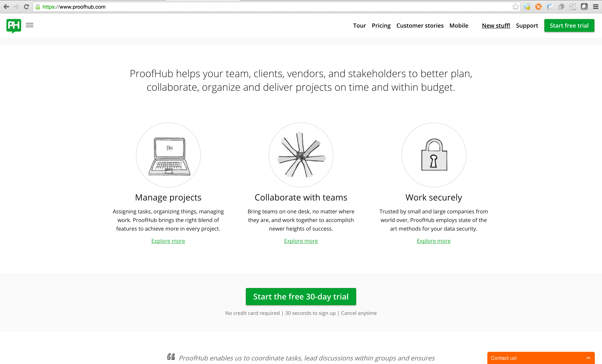
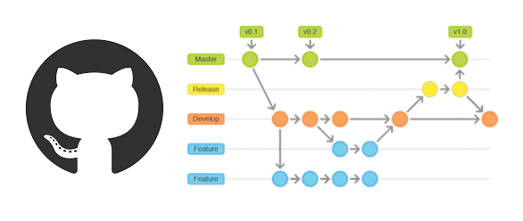

##Unleashing Github
#####_(Unlocking the power of version control / distributed collaboration)_
<p>
	</br>
	<small><a href="https://twitter.com/alexniderberg">@AlexNiderberg</a></small><br/>
	<small>iOS and Android Reliability Engineering - Capital One</small>
</p>


###Presentation Objectives
<ul>
<li>Introduce version control using Git and Github.</li>
<li>Prepare you for your hackathon later this week.</li>
<li>Leave you excited to become a version control expert.</li>
</ul>
<br/><br/>
<p class="fragment">
[<u>Collaboration</u> is one of the top 3 skills that companies need.](https://learning.linkedin.com/blog/top-skills/the-skills-companies-need-most-in-2019--and-how-to-learn-them)
</p>


<br>
<small><a href="https://capitalonecareers.com/">Capital One</a></small>


<br>
<small><a href="https://www.capitalonelabs.com/#/about">Capital One Labs</a></small>

---

##The Software Development Life Cycle


###I did it!!!
<iframe src="https://giphy.com/embed/PzOm3LPWu7fJS?hideSocial=true" width="680" height="567" frameborder="0" class="giphy-embed" allowfullscreen=""></iframe>
<!-- victory-reaction-jennifer-lawrence-PzOm3LPWu7fJS -->


####Joy turns to anger so quickly


###How can I prevent this from happening again??
<iframe src="https://giphy.com/embed/FdvUazOcLjwzK?hideSocial=true" width="680" height="567" frameborder="0" class="giphy-embed" allowfullscreen=""></iframe>
<!-- ConfusionCubsRunning-FdvUazOcLjwzK -->


##Living a version controlled lifestyle
- We could zip our project folders to make versioned backups?
```
myHackathonProject/
myHackathonProject_180930.zip
myHackathonProject_181003.zip
myHackathonProject_181031.zip
```
- Or we could copy individual files and send them to team mates?
```
core_ui.js
core_ui2.js
core_ui3.js
```

<h3 class="fragment">That sounds tedious...</h3>

Note: Off to a good start


##What is Git?

```
GIT(1)                            Git Manual                            GIT(1)

NAME
       git - the stupid content tracker
```

- distributed version control system
- allows you to work off-line
- provides a collaboration framework


##Linus 2007 git overview

</br>
<small>Source: <a href="https://www.youtube.com/watch?v=4XpnKHJAok8#t=819">Linus 2007 Git Introduction</a></small>
Note: Using CVCS penalizes you from committing and branching since it is so expensive.  This causes developers to have very large commits.


###Here we go!
<iframe src="https://giphy.com/embed/9UCStxAde7lK?hideSocial=true" width="680" height="567" frameborder="0" class="giphy-embed" allowfullscreen=""></iframe>
<!-- RollAndSlide-XGHCQGcfyl6lW -->
<!-- penguinSlide_hereWeGo-9UCStxAde7lK -->


##Centralized VCS

</br>
<small>Source: <a href="https://betterexplained.com/articles/intro-to-distributed-version-control-illustrated/">Illustrated Distributed Version Control</a></small>


##Distributed VCS

<small>Source: <a href="https://betterexplained.com/articles/intro-to-distributed-version-control-illustrated/">Illustrated Distributed Version Control</a></small>
Note: Every copy of a git branch becomes it's own branch when it falls off line or out of sync with origin. Git has a built in check for disk / file corruption since files are tracked using a hash.

---

## Learn by doing

### Setting up our <u>local</u> repository.


###Project Local Repository: git init
<p align="left">1. Create a folder to store our project.</p>

<p class="fragment" align="left">
2. Verify the folder is empty.<br/>
&emsp;&emsp;`ls -a`
</p>

<p class="fragment" align="left">
3. Initialize the git repository inside to track all changes.<br/>
&emsp;&emsp;`git init`
</p>

<p class="fragment" align="left">
4. Verify that the repository has been made.<br/>
&emsp;&emsp;`ls -a`
</p>

<p class="fragment" align="left">
5. Explore the hidden `.git` folder.
</p>
<aside class="notes">
<li>To tell finder to show all hidden files and folders, use `defaults write com.apple.finder AppleShowAllFiles YES` and relaunch finder.</li>
<li>Git stores information about your project in the `.git` subfolder. This hidden .git folder in the root of your project is the git repository and keeps track of all versions of your files over time.</li>
<li>You can revert to any changes.</li>
<li>If you delete the .git folder... the only version will be the latest version as the files currently exist (the history will be wiped)</li>
</aside>


###Project Inspection: git status and log
<p class="fragment" align="left">
1. Verify the status.<br/>
&emsp;&emsp;`git status`
</p>

<p class="fragment" align="left">
2. Look at previous commits.<br/>
&emsp;&emsp;`git log`
</p>

<br/>
<h3 class="fragment">Time to add some content...</h3>


###Project Update: Add a file
<p align="left">1. Add a `README`.<br/>
&emsp;&emsp;`echo "# MyHackathonProject" >> README.md`<br/>
</p>

<p class="fragment" align="left">
2. Verify that it is [untracked](http://rogerdudler.github.io/git-guide/#workflow) and in the <u>working index</u>.<br/>
&emsp;&emsp;`git status`
</p>

<p class="fragment" align="left">
3. Add it to the <u>staging index</u>.<br/>
&emsp;&emsp;`git add README.md`
</p>

<p class="fragment" align="left">
4. Verify that it is now being tracked and in the <u>staging index</u>.<br/>
&emsp;&emsp;`git status`
</p>

<p class="fragment" align="left">
5. Visualize the staging vs working trees in `git gui`.<br/>
&emsp;&emsp;`git gui`
</p>


###Project Progress: first commit
<p class="fragment" align="left">
1. Commit it to the repository.<br/>
&emsp;&emsp;`git commit -m "Add the README"`
</p>

<p class="fragment" align="left">
2. Verify that we have no uncommitted changes.<br/>
&emsp;&emsp;`git status`
</p>

<p class="fragment" align="left">
3. Look at the logs (there should now be 1 entry).<br/>
&emsp;&emsp;`git log`<br/>
&emsp;&emsp;`git log --oneline`<br/>
&emsp;&emsp;`git log -n 3`
</p>

<p class="fragment" align="left">
4. Modify the last commit message and compare the SHAs.<br/>
&emsp;&emsp;`git commit --amend`<br/>
&emsp;&emsp;`git log`
</p>
Note: When creating a new file or updating existing file and saving those changes, it will create a commit object


##Key Git Concepts - Checkpoint 1
- Staging Area / Working Copy
- Commit Object
- .git repository
- Some initial commands (init, status, log, add, commit)


###Project Progress: git diff
- Compare <u>**git diff**</u> to <u>**git diff --staged**</u> by making more changes to the README.
- Also compare these in the GUI (and undesired tmp folder)


##What does commit object hold?
- reference to parent commit, if any
- tree - set of files conveying current state of the project
- author info, commiter info, commit message, etc.
Commit object is uniquely identified by a 40-character SHA1 hash


###Commit Object


```
git cat-file -p master
git cat-file -p a7ba36a62d8d8a40d4d9bc4386cc1ae174aff555
cat-file -p cfcae178cfcf1948c2aca252ebed8146c8aada4f
```


##Getting started

```
$ git init
```


###Here we go now
<iframe src="https://giphy.com/embed/XGHCQGcfyl6lW?hideSocial=true" width="680" height="567" frameborder="0" class="giphy-embed" allowfullscreen=""></iframe>
<!-- RollAndSlide-XGHCQGcfyl6lW -->
<!-- penguinSlide_hereWeGo-9UCStxAde7lK -->

---

##Key Git Concepts
- Staging Area / Working Copy
- Commit Object
- .git repository
- Branches
- Stashing
- Merging
Note: Are git and github the same?


##Edit / Stage / Commit

Note: What you are actually staging is a snapshot.  With every change you need to re-add it or stage it using git add.


###Off to a good start
<iframe src="https://giphy.com/embed/l41lIioP4RFRmIVB6?hideSocial=true" width="680" height="567" frameborder="0" class="giphy-embed" allowfullscreen=""></iframe>
<!-- dogRunning-afv-funny-fail-lol-l41lIioP4RFRmIVB6 -->


##Freedom and safety
####Branches


##Branching

```
$ git branch
  master
* release
```


### A branch is collection of commit objects
When initializing a git repo the default branch is master
<pre><code>
    (1) -- (2) -- (3)
                   |
                 master
                   |
                  HEAD
</code></pre>
HEAD points to commit (3) on master branch
<pre><code>
    #Switching branches
    $ git checkout [branch-name]
</code></pre>


###Branches let me try new things!!
<iframe src="https://giphy.com/embed/tbAY4hlx9fzjy?hideSocial=true" width="400" height="400" frameborder="0" class="giphy-embed" allowfullscreen=""></iframe>
<!-- Flying?-tbAY4hlx9fzjy -->


#####[Animation Demo](https://bitbucket.org/aln787/flightinfo)
```
/Users/xvo202/Development/animationDemo/loginexamples
```

Note: This repo should have the demo, pull and confirm https://bitbucket.org/aln787/flightinfo


#Stashing


####Visualize the state of different versions of the project


####Git empowers you with a frame-work for review explicit changes



###That is great if you have standards!
<iframe src="https://giphy.com/embed/3SCKnFChtClxK?hideSocial=true" width="680" height="567" frameborder="0" class="giphy-embed" allowfullscreen=""></iframe>
<!-- MindyProjectI-HaveStandards-life-up-3SCKnFChtClxK -->


### Usage Patterns: e.g. Git-flow


###Way so may commits??
<iframe src="https://giphy.com/embed/lYKvaJ8EQTzCU?hideSocial=true" width="680" height="567" frameborder="0" class="giphy-embed" allowfullscreen=""></iframe>
<!-- jon-stewart-why-lYKvaJ8EQTzCU -->


##Tidying up


##Rebasing
- Clean-up your commit history locally
  - `git rebase -i HEAD~3`
- Prepare for a pull request
  - git rebase -i master


##Additional clean-up
- Update the commit message
  - `git commit --amend`
- Break changes in to smaller pieces
  - `git add -i`
- Update the commit author
  - `git commit --amend --author="Your Name <yourEmail@email.com>"`


###Much better!!
<iframe src="https://giphy.com/embed/2ur8NS5TYQmK4?hideSocial=true" width="680" height="567" frameborder="0" class="giphy-embed" allowfullscreen=""></iframe>
<!-- CuddleFest-2ur8NS5TYQmK4 -->


##Tagging
```
git tag v0.3.8
git tag v0.3.8 44a2a4a2bf8b85214551ce93227d4af7981e8eca
git tag --list
git push --tags
git push origin v0.3.8
```

---

##Github Tools / Features


##GH-Pages


[](https://aln787.github.io/revealGhPages/#/1/1)

- [Reveal-MD/GH-Pages Overview](https://aln787.github.io/revealGhPages/#/1/1)
Note:Review the vertical section titled 'MAKING CREATING PRESENTATIONS FEEL MORE LIKE PROGRAMING' beginning with the slide 'TURNS THIS'.


##Reveal.js Resources
- [Theme Options](https://lab.hakim.se/reveal-js/?transition=convex#/themes)
- [GUI Editor](https://slides.com/)
- [Project repo and notes on external markdown](https://github.com/aln787/reveal.js#external-markdown)


###Optional Hands-on Exercise 

- [Full Instructions](https://github.com/aln787/revealMD-simpleStarter/blob/gh-pages/README.md#quick-start)
- Overview
  - From public github, fork my repository
  - Update the place holder values
  - Commit the changes
  - View your example presentation


###Suprising how easy that was!
<iframe src="https://giphy.com/embed/vBVCam8nE7uxy?hideSocial=true" width="680" height="567" frameborder="0" class="giphy-embed" allowfullscreen=""></iframe>
<!-- GetTheBabby-vBVCam8nE7uxy -->


##Aside on Markdown



###Markdown Resources
- [Docs](https://daringfireball.net/projects/markdown/syntax)
- [Great blog post on mastering markdown](https://designshack.net/articles/html/mastering-markdown-30-resources-apps-and-tutorials-to-get-you-started/)


##Wiki





##Wiki examples
- [Guard](https://github.com/guard/guard/wiki)
- [Titan](https://github.com/thinkaurelius/titan/wiki)
- [SnowPlow](https://github.com/snowplow/snowplow/wiki)
- [Hystrix](https://github.com/Netflix/Hystrix/wiki)
- [d3](https://github.com/mbostock/d3/wiki)
- [Github's list of great wiki's](https://github.com/showcases/projects-with-great-wikis)


##Issues



<!-- Add a link to open nucleus issues -->

---

##Collaboration
- Distributed version control model to collaborate between multiple developers.

  - Remote repository
  - Pull remote changes
  - Push local changes to remote


##Remote repository
- Remote repositories are versions of your project that are hosted on the Internet or network somewhere.
  
  - Create a new remote repository(on github, bitbucket, etc.) and clone to your local machine. Or,
  - Add existing git repo from your local machine to remote


##Create a new remote repo and clone to your local machine
- Create new remote repository on github or bitbucket
<pre><code>$ git clone [git-remote-repo-url].git</code></pre>
- As name suggests <span style="color: #1b91ff">clone</span> command can be used to clone any remote repository 


##Add existing git repo from local machine to remote
Create new repository on <a href="https://help.github.com/articles/creating-a-new-repository/" title="">github</a> or bitbucket
On your local machine..
<pre><code>
$ git remote add origin [git-remote-repo-url].git
$ git push -u origin master
</code></pre>
<p><span style="color: #1b91ff">origin</span> is a remote repository reference that git uses</p>


##Pulling remote changes
<pre><code>
$ git pull [remote-repo-reference] [remote-branch-name]
$ git pull origin master
</code></pre>


##Pushing changes to remote
<pre><code>
$ git push [remote-repo-reference] [remote-branch-name]
$ git push origin master
</code></pre>


##Multiple Remotes
<pre><code>
origin  https://github.com/aln787/git-collab.git (fetch)
origin  https://github.com/aln787/git-collab.git (push)
14109fd767af:git-collab $ git remote -v
other /git-collab.git (fetch)
other /git-collab.git (push)
origin  https://github.com/aln787/git-collab.git (fetch)
origin  https://github.com/aln787/git-collab.git (push)
</code></pre>


#Fork and Pull


##[Fork Exercise](https://github.com/aln787/GitExercise)

Note: https://github.com/aln787/git-collab/wiki#exercise


##Merge conflicts
While pulling or merging a branch merge conflicts can occur due to conflicting changes

---

##Additional Git Concepts
- git config
- vim .gitignore
- git diff [ --staged | --cached ]
- git add --patch
- git [command] --help or man git


##Git Config
- git config --list
- git config --global user.name "Your Name"
- git config --global user.email yourEmail@gmail.com
- git config --global push.default simple #remove verbose messaging about the git 2.0 change
- git config --global core.editor "subl -n -w" #editor for commit messages
- git commit -a #will bring up sublimetext so you can enter you commit message


<h2><span style="text-transform: lowercase;">.gitignore</span> the unsung hero</h2>
- It is very important to have this file in your project root directory to avoid merge conflicts from auto-generated code from VM, IDE, etc.
- Google for gitignore nodejs/golang/java/android/iOS


##Diff Options
<pre><code>
#git diff [ --staged | --cached ]
$ git status
# At least 1 file is staged
$ git diff --staged
# Reveals the staged changes
$ git reset #to push those changes back to the working copy
</code></pre>


##Break Changes into Smaller Pieces
<pre><code>
#git add --patch [file]
$ git add --patch
#Use s for smaller y, n, ...
</code></pre>


##Get Git Help
<pre><code>
#git [command] --help or man git
$ git diff --help
$ man git
# Then use / to search for --ca
</code></pre>

---

#Tips and Tricks


####If you are ever unsure what to do when using Git, copy your project directory.


##Setting Up SSH Keys
<pre><code>
$ ls -al ~/.ssh
$ ssh-keygen -t rsa -b 4096 -C "youremail@email.com"
$ eval "$(ssh-agent -s)"
$ ssh-add ~/.ssh/id_summit2016
$ cat ~/.ssh/id_summit2016.pub 
</code></pre>
Then add the output of the cat to your list of github ssh keys on the github site.  
<pre><code>$ ssh -T git@github.com</code></pre>
</br>
<a href="https://help.github.com/articles/generating-ssh-keys">Full Set-up details</a>


##Additional Git Commands
- git diff HEAD^ --word-diff
  - git config --global help.autocorrect1
- git config --global color.ui 1
- git commit --amend -C HEAD
  - Use this to add changes you forgot to add to the last commit that are currently staged

---

##3 Things 
- Power / responsibility associated with Git / Github
- Advanced features
- Portable skill, so be come an expert

---

###Thank you!!! 


---

###References
- https://git-scm.com/
- [SO git questions](https://stackoverflow.com/questions/tagged/git)
- https://help.github.com/
- [May 3rd, 2007 - Linus Torvalds Git Talk](https://www.youtube.com/watch?v=4XpnKHJAok8)
- [Great git talk from one of the git scm writers](https://www.youtube.com/watch?v=ZDR433b0HJY)
- [Git History](https://www.atlassian.com/git/articles/10-years-of-git/)
- [Original Presentation](https://github.com/vmaliwal/git-collab)
Note: https://git-scm.com/book/en/v2/Getting-Started-About-Version-Control

---

##Appendix
<!-- Replace the appendix with the link to the same talk intended for a technical audience. -->

---

##Alternatives / Outstanding Issues for designers


##Outstanding Issues
- 100MB file limit
- Git / Git-hub specialty is text or non-binary files
- Git has a bit of a learning curve that scares some people off


##Alternatives


####[Pixelapse](https://www.pixelapse.com/)

- (Y-Combinator project acquired by Drop Box)


####[Pixelapse - Fast-co article](https://www.fastcodesign.com/3038135/ex-googler-builds-a-github-for-designers/3 )



####[Proofhub](https://www.proofhub.com)



###Other useful links I came across while creating this presentation
- https://www.freeimages.com/
- https://dribbble.com/
- https://www.google.com/fonts/
- https://www.deviantart.com/

<!-- - https://www.computerworld.com/article/2875451/dropbox-buys-pixelapse-to-add-version-control-for-visual-designers.html
- https://www.lynda.com/GitHub-tutorials/GitHub-Web-Designers/162276-2.html
- https://blog.teamtreehouse.com/git-for-designers-part-1
- https://www.designernews.co/stories/25506-ask-dn-do-you-use-github-for-design-assets
- https://www.quora.com/Is-there-something-like-Github-for-graphic-design
- https://venturebeat.com/2014/06/05/for-designers-version-control-is-a-big-problem-but-github-is-close-to-solving-it/
- https://github.com/blog/392-intro-to-git-for-designers
- https://www.fastcodesign.com/3038135/ex-googler-builds-a-github-for-designers/3 -->
<!--  -->

---

##Git in Action
<!-- TODO: Update with screen shots of using source tree -->
- Status
- Init
- Clone
- Diff
- Commit


##Check for git repo
<pre><code>
$git status
fatal: Not a git repository (or any of the 
parent directories): .git
</code></pre>


##Initializing Repository
<pre><code>
$ mkdir [project-name]
$ cd [project-name]
$ git init
</code></pre>
<pre><code>
git-collab/
  .git/
    config
    description
    HEAD
    hooks/
    info/
    objects/
    refs/
</code></pre>


##Cloning existing repository
<pre><code>
$ git clone [git-url]
$ git clone https://github.com/vmaliwal/git-collab.git
</code></pre>


##Untracked Changes / Files
<pre><code>
$ git status
On branch master
Your branch is up-to-date with 'origin/master'.

Changes not staged for commit:
(use "git add <file>..." to update what will be committed)
(use "git checkout -- <file>..." to discard changes in working directory)

modified:   README.md
modified:   index.html

Untracked files:
(use "git add <file>..." to include in what will be committed)

images/CentralizedVCS.png
images/DistributedVCD.png
images/LinusViewDVCS.png

no changes added to commit (use "git add" and/or "git commit -a")
</code></pre>


##Git Diff
<pre><code>
$ git diff README.md 
diff --git a/README.md b/README.md
index f08ca69..10ea20b 100644
- a/README.md
+ b/README.md
@@ -1 +1,9 @@
-### Introduction to Git 
\ No newline at end of file
+### Introduction to Git 
+
+- run
+```
+npm install
+grunt serve
+```
+
+- Make changes by modifying index.html
\ No newline at end of file
</code></pre>


##Creating a commit object
Create a new file or modify existing
<pre><code>$ echo "Introduction to Git" > README</code></pre>

<pre><code>
$ git status
# On branch master
#
# Initial commit
#
# Untracked files:
#   (use "git add [file]..." 
# to include in what will be committed)
#
# README
</code></pre>

Note: When creating a new file or updating existing file and saving those changes will create a commit object


##Add
<pre>
  <code>
$ git add [file-name]
$ git commit -m "Initial commit"
  </code>
</pre>

<pre>
  <code>
$ git add . //to add all modified files, or
$ git commit -a -m "Initial commit"
  </code>
</pre>


##Commit
<pre>
  <code>
Git commit -a #is the same as using git add and then git commit
git config --global color.ui true
  </code>
</pre>
